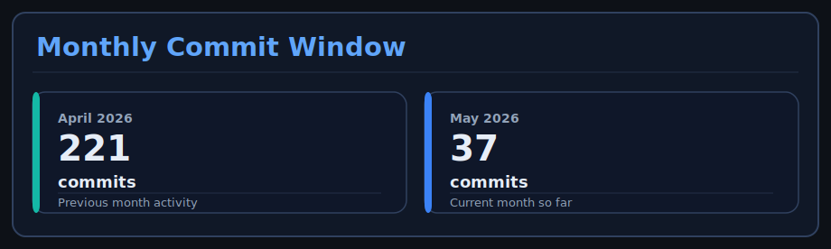
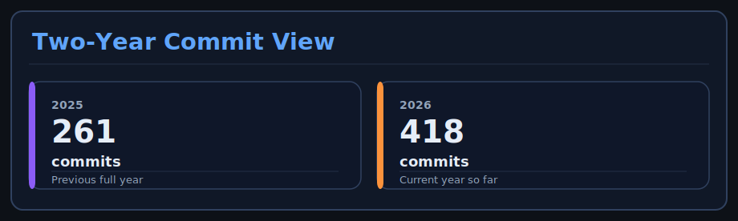

<!-- THIS FILE IS GENERATED. Edit files in data/ and run `python generate_readme.py`. -->

<div align="center">

<h1>Hi, I'm Rishit Ghosh</h1>

<p><strong>Software Engineer | AI/ML Explorer | Open Source Contributor</strong></p>


<br />

<p>I enjoy turning ideas into maintainable software: clean architecture, thoughtful interfaces, and workflows that make collaboration easier.</p>

<br />

<a href="https://rajghosh06-dev.github.io/portfolio/" target="_blank"></a> <a href="https://linkedin.com/in/rajghosh06" target="_blank"></a> <a href="mailto:rishitghosh06@gmail.com" target="_blank"></a>

<br />

  

<br />

<p><sub>Hyderabad · B.Tech CSE-AI&ML @ GCET</sub></p>

</div>

<br />

```bash
rishit@github:~$ focus
building durable software, practical AI experiments, and cleaner developer workflows
rishit@github:~$ current_mode
Java systems | Python automation | Open Source momentum | product-minded craft
```

<br />

- Building Java and Python systems with a bias for clarity, modularity, and reliability.
- Mixing software engineering, AI/ML experimentation, and developer tooling.
- Caring about documentation, presentation, and the details that make projects feel complete.

---
## About Me

- I like building software that feels organized on the inside and approachable on the outside.
- My sweet spot is Java and Python projects where architecture, usability, and long-term maintainability matter.
- I also enjoy the creative side of tech: shaping identity, presentation, and the way projects are experienced.

---
## Current Sprint

- [ ] Ship richer editing controls in Calculator-AWT, including backspace, decimal input, and better expression handling.
- [ ] Strengthen Campus Connect with better validation, cleaner architecture, and deployment readiness.
- [ ] Push the pollution prediction project toward stronger evaluation and clearer visual storytelling.

---
## Spotlight Project

### [Calculator-AWT](https://github.com/rajghosh06-dev/Calculator-AWT)

A Java AWT calculator that reflects the way I like to build: reusable UI pieces, readable event handling, and a structure that stays easy to extend.

`Java` `AWT` `Object-Oriented Design`

**Why it stands out:**
- Reusable component-driven UI instead of one-off widget wiring
- Extended calculator controls with clean event flow
- Readable structure that makes future enhancement easier

---
## GitHub Pulse

A quick look at the repositories, languages, and contribution patterns behind my profile.

<br />

<div align="center">


</div>

<br />

<div align="center">


<br /><br />



<br /><br />



<br /><br />


</div>

---
## Strengths

| Focus Area | What It Looks Like |
| --- | --- |
| **Software Architecture** | Break systems into clean, reusable pieces that are easier to extend, review, and maintain. |
| **AI/ML Workflows** | Turn experiments into practical workflows with reproducibility, evaluation, and clearer problem framing. |
| **Developer Experience** | Improve setup, documentation, repo structure, and day-to-day workflow quality for contributors. |
| **Product Presentation** | Make projects easier to understand through stronger writing, visuals, and thoughtful polish. |

---
## How I Work

| Approach | In Practice |
| --- | --- |
| **🧩 Build modular systems** | I enjoy turning messy requirements into clean structures that are easier to read, extend, and review. |
| **⚙️ Improve developer workflow** | From repo organization to automation and documentation, I like removing friction for future contributors. |
| **🧠 Experiment with AI/ML** | I explore practical ML workflows, reproducibility, and problem-solving beyond toy demos. |
| **🎨 Add creative polish** | I care about how projects look, feel, and communicate, not just how they run. |

---
## Tech Stack & Tools

### Languages

<div align="center">

<table><tbody><tr><td align="center" width="120">
  
  <br>C
</td><td align="center" width="120">
  
  <br>Python
</td><td align="center" width="120">
  
  <br>Java
</td><td align="center" width="120">
  
  <br>SQL
</td><td align="center" width="120">
  
  <br>HTML
</td></tr></tbody></table>

</div>

### Frameworks

<div align="center">

<table><tbody><tr><td align="center" width="120">
  
  <br>AWT
</td><td align="center" width="120">
  
  <br>Flask
</td><td align="center" width="120">
  
  <br>Maven
</td></tr></tbody></table>

</div>

### Tools

<div align="center">

<table><tbody><tr><td align="center" width="120">
  
  <br>PyCharm
</td><td align="center" width="120">
  
  <br>IntelliJ
</td><td align="center" width="120">
  
  <br>Jupyter
</td><td align="center" width="120">
  
  <br>Git
</td><td align="center" width="120">
  
  <br>VS Code
</td></tr></tbody></table>
<table><tbody><tr><td align="center" width="120">
  
  <br>Eclipse
</td><td align="center" width="120">
  
  <br>Dev C++
</td></tr></tbody></table>

</div>

### What I Optimize For

- Environment isolation
- Package integrity
- Modular GUI design

---
## Featured Builds

| Project | Snapshot |
| --- | --- |
| [Calculator-AWT](https://github.com/rajghosh06-dev/Calculator-AWT) | Modular desktop calculator with reusable UI pieces and clean Java event-driven logic.<br /><sub>Java • AWT</sub> |
| [Campus Connect](https://github.com/CampusConnectHub/campus-connect-portal) | Campus collaboration portal focused on reliability, clarity, and structured data handling.<br /><sub>Java • MySQL</sub> |
| [Pollution Drift Predictor](https://github.com/rajghosh06-dev/Pollution-Drift-Predictor) | AI-driven environmental project exploring prediction, analysis, and visualization around pollution movement.<br /><sub>Python • Machine Learning • Data Analysis</sub> |

---
## Open Source Moments

<div align="center">

<a href="https://www.holopin.io/hacktoberfest2025/userbadge/cmg3k9fn3000cjm046diy38pb" target="_blank"></a>

</div>

**Hacktoberfest 2025: Level 0 Registered** — Awarded on September 28, 2025 for registering in Hacktoberfest 2025.

---
> _"Modularity is not just a coding principle; it is how I think through problems."_
